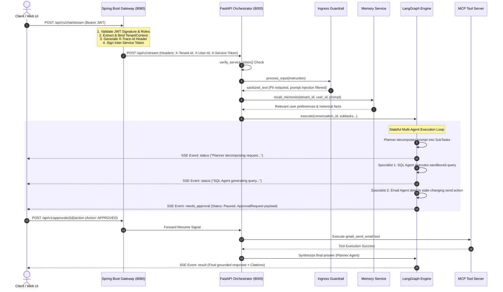
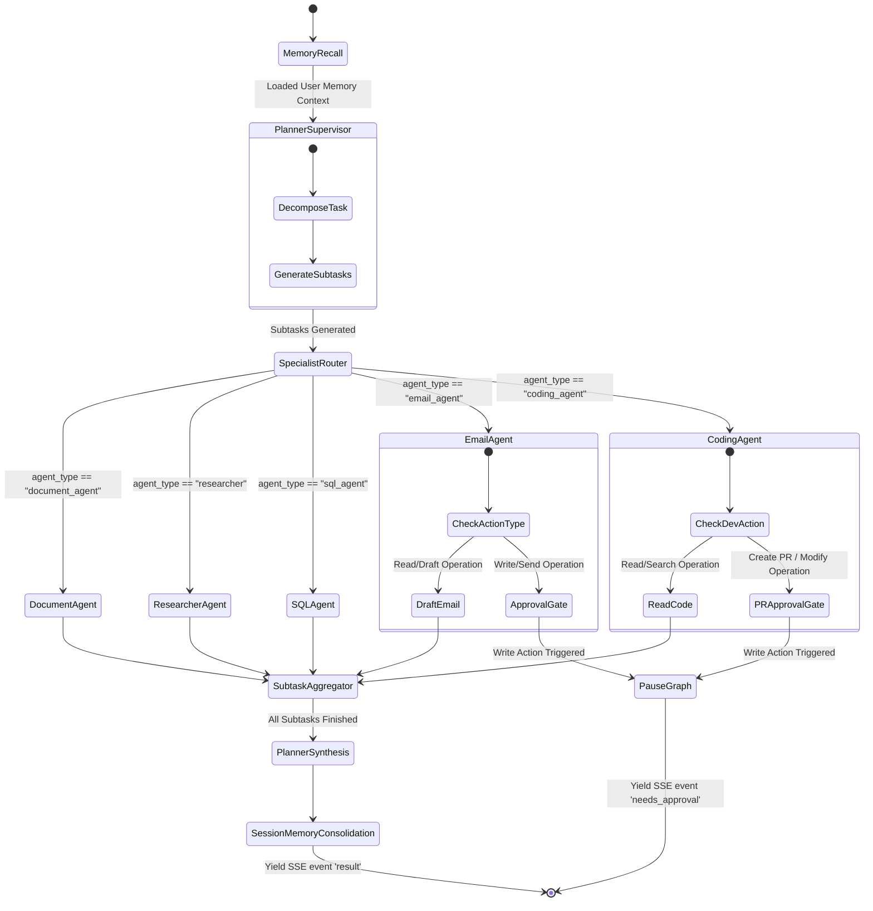

# 🏛️ Technical Architecture & Interview Deep-Dive Guide
> **Enterprise AI Worker Platform: Multi-Tenant Multi-Agent Infrastructure**

---

## 📋 Executive Overview & Quick Pitch

When explaining this platform in an interview, start with this **30-second elevator pitch**:

> *"Enterprise AI Worker is a production-grade, multi-tenant SaaS system designed to give enterprise teams an intelligent AI worker integrated across Slack, Gmail, Google Calendar, SQL databases, Jira, and GitHub.
> 
> Architecturally, it uses a **decoupled dual-stack topology**: a **Java 17/21 Spring Boot Gateway** for high-throughput authentication, tenant context isolation, RBAC role enforcement, and audit logging; paired with a **Python 3.12 FastAPI Agent Orchestrator** running **LangGraph multi-agent state machines**.
> 
> Key features include **ACL-aware vector RAG**, **sandboxed SQL generation**, **Model Context Protocol (MCP) tool micro-servers**, and **Human-in-the-Loop (HITL) approval checkpoints** for all state-changing write operations."*

---

## 🏗️ 1. Decoupled Dual-Stack Microservice Topology

```
+-----------------------------------------------------------------------------------+
|                                 React 18 + TS Web UI                              |
|                       (Real-Time SSE Stream, HITL Approval Modals)                |
+--------------------------------─────────+-----------------------------------------+
                                          | HTTPS / Server-Sent Events (SSE)
                                          v
+-----------------------------------------------------------------------------------+
|                      Edge Gateway (Java 17/21 - Spring Boot 3.2)                  |
|  - AuthN (JWT / OIDC) & RBAC Enforcement (OWNER, ADMIN, MEMBER, VIEWER)          |
|  - TenantContext ThreadLocal Isolation                                           |
|  - Database Schema Migrations (Flyway) & Immutable Audit Logging                  |
+-----------------------------------------+-----------------------------------------+
                                          | Signed Service Token (Internal JWT Header)
                                          v
+-----------------------------------------------------------------------------------+
|                    Agent Orchestrator (Python 3.12 - FastAPI)                     |
|  - Ingress Guardrails (Prompt Injection Filtering, PII Redaction)                |
|  - Long-Term Semantic Memory & Fact Consolidation Service                        |
|  - LangGraph Multi-Agent Engine (Planner Supervisor + Specialist Agents)          |
|  - ACL-Aware Vector RAG Retriever (pgvector)                                     |
+--------+------------------+------------------+-------------------+----------------+
         |                  |                  |                   |
         v                  v                  v                   v
+-----------------+ +---------------+ +------------------+ +----------------+
|   MCP Servers   | | PostgreSQL 16 | | Vector DB        | | Redis 7        |
| (Slack, Gmail,  | | (Tenants,     | | (pgvector with   | | (Checkpoints & |
| Jira, GitHub,   | |  Users, Audit | |  ACL tags)       | |  Memory Cache)|
| Calendar, SQL)  | |  Logs)        | |                  | |                |
+-----------------+ +---------------+ +------------------+ +----------------+
```

### Component Responsibilities & Technology Rationale

| Layer | Component | Language / Framework | Primary Responsibility | Architectural Rationale |
|---|---|---|---|---|
| **Edge Gateway** | `gateway/` | Java 17/21, Spring Boot 3.2 | AuthN, RBAC, Tenant Context, Flyway DB Migrations, Audit Logging | Enterprise-grade stability, robust thread-safety, high concurrent IO, industry-standard security ecosystem. |
| **Orchestrator** | `orchestrator/` | Python 3.12, FastAPI | LangGraph state machines, LLM integration, Guardrails, RAG | Standard ecosystem for AI/LLM libraries (LangChain, PyDantic, OpenAI/Gemini SDKs). |
| **Tools Protocol** | `mcp-servers/` | Python, Node | Isolated MCP servers for Slack, Gmail, Jira, GitHub, SQL | Decouples third-party API dependencies and standardizes tool definitions. |
| **Data & Memory** | DB & Cache | PostgreSQL 16 + `pgvector`, Redis 7, MinIO | Storage of tenant metadata, vector embeddings, graph checkpoints, audit logs | `pgvector` provides operational simplicity by unified storage of relational and vector data in ACID DB. |

---

## ⚡ 2. End-to-End Request Lifecycle (Client API → Output)



### Detailed Sequence Explanation for Interviews

1. **Gateway Auth & Context Injection**:
   - Client sends HTTP POST to `/api/v1/chat/stream` on port `8080`.
   - Spring Boot Gateway intercepts request, validates JWT, checks RBAC permissions (`OWNER`, `ADMIN`, `MEMBER`, `VIEWER`), and sets `TenantContext`.
   - Gateway attaches `X-Tenant-Id`, `X-User-Id`, `X-User-Role`, and `X-Trace-Id` headers and signs the internal HTTP request with `SERVICE_TO_SERVICE_SECRET`.
2. **Orchestrator Ingress Verification & Guardrails**:
   - FastAPI inspects request headers via [`verify_service_token`](file:///c:/Users/HP/Documents/enterprise-ai-worker/orchestrator/app/api/chat.py#L43-L56).
   - [`GuardrailPipeline`](file:///c:/Users/HP/Documents/enterprise-ai-worker/orchestrator/app/guardrails/pipeline.py) scans input for prompt-injection threats and redacts sensitive PII (SSNs, credit card numbers).
3. **Memory Context Injection**:
   - [`MemoryService`](file:///c:/Users/HP/Documents/enterprise-ai-worker/orchestrator/app/memory/memory.py) fetches historical facts matching the query context.
4. **LangGraph Execution Loop**:
   - [`MultiAgentGraph.execute()`](file:///c:/Users/HP/Documents/enterprise-ai-worker/orchestrator/app/graph/graph.py#L26-L208) runs as an async generator.
   - **Planner Agent** breaks the prompt into structured `SubTask` items.
   - Specialist agents run iteratively.
5. **Human-in-the-Loop Pause & Resume**:
   - State-changing write actions (`send_email`, `create_pull_request`) pause execution and emit a `needs_approval` event.
   - The graph state is checkpointed in Redis.
   - Upon human approval, graph resumes state and executes the write tool.
6. **Output Synthesis & SSE Streaming**:
   - Planner Agent synthesizes final answers with document citations.
   - Tokens and status updates stream to the client via Server-Sent Events (`text/event-stream`).

---

## 🤖 3. Multi-Agent Engine (LangGraph Supervisor Pattern)



### Specialist Agents Breakdown

| Specialist Agent | Core File | Key Responsibilities & Security Controls |
|---|---|---|
| **Planner (Supervisor)** | [`planner.py`](file:///c:/Users/HP/Documents/enterprise-ai-worker/orchestrator/app/agents/planner.py) | Goal decomposition, subtask routing, final answer synthesis with citations. |
| **Document Agent** | [`document_agent.py`](file:///c:/Users/HP/Documents/enterprise-ai-worker/orchestrator/app/agents/document_agent.py) | Vector similarity search on internal documents with strict `tenant_id` and ACL permission tag filtering. |
| **Researcher Agent** | [`researcher.py`](file:///c:/Users/HP/Documents/enterprise-ai-worker/orchestrator/app/agents/researcher.py) | Hybrid retrieval combining document vector search with Knowledge Graph multi-hop entity traversal. |
| **SQL Agent** | [`sql_agent.py`](file:///c:/Users/HP/Documents/enterprise-ai-worker/orchestrator/app/agents/sql_agent.py) | Text-to-SQL generation validated by [`SQLValidator`](file:///c:/Users/HP/Documents/enterprise-ai-worker/orchestrator/app/sql/sql_validator.py) (`SELECT`-only, mandatory `WHERE tenant_id = :tenant_id`, `LIMIT 100`). |
| **Email Agent** | [`email_agent.py`](file:///c:/Users/HP/Documents/enterprise-ai-worker/orchestrator/app/agents/email_agent.py) | Inbox search, drafting, sending via Gmail MCP server. External sends require HITL approval. |
| **Coding Agent** | [`coding_agent.py`](file:///c:/Users/HP/Documents/enterprise-ai-worker/orchestrator/app/agents/coding_agent.py) | Repo analysis, Jira issue triaging, GitHub PR creation via GitHub/Jira MCP. PR creation requires HITL approval. |

---

## 🛡️ 4. Security, Multi-Tenancy & ACL RAG Architecture

```
                              Incoming Query
                                     │
                                     ▼
                      ┌─────────────────────────────┐
                      │  Tenant Isolation Filter    │
                      │   chunk.tenant_id == tenant │
                      └──────────────┬──────────────┘
                                     │ Pass
                                     ▼
                      ┌─────────────────────────────┐
                      │    ACL Security Check       │
                      │  Is Role OWNER/ADMIN?       │
                      └──────┬───────────────┬──────┘
                         Yes │               │ No
                             ▼               ▼
                      ┌────────────┐   ┌────────────────────────────┐
                      │ Access     │   │ User ACL Tag Verification  │
                      │ Granted    │   │ Any(tag in user_acls)?     │
                      └────────────┘   └──────┬──────────────┬──────┘
                                          Yes │              │ No
                                              ▼              ▼
                                       ┌────────────┐  ┌────────────┐
                                       │ Access     │  │ Blocked    │
                                       │ Granted    │  │ (Filtered) │
                                       └────────────┘  └────────────┘
```

1. **Multi-Tenant Isolation**:
   - Database level: Every SQL query enforces `WHERE tenant_id = :tenant_id`.
   - Vector store level: [`VectorStore.search()`](file:///c:/Users/HP/Documents/enterprise-ai-worker/orchestrator/app/rag/retriever.py#L82-L132) drops any document chunk where `chunk.tenant_id != tenant_id`.
2. **ACL Permission Tag Matching**:
   - Chunks store metadata tags (`acl: ["FINANCE_READ"]`).
   - Non-admin users are granted access **only if** their `user_acls` overlap with the chunk's `acl` tags.
3. **Untrusted Data Wrapping**:
   - Retrieved third-party chunks are wrapped in `<untrusted_data>` tags when passed to LLMs to prevent indirect prompt-injection hijacking.

---

## 🔌 5. Model Context Protocol (MCP) Integration

Tools are integrated via dedicated MCP micro-servers registered in [`MCPClient`](file:///c:/Users/HP/Documents/enterprise-ai-worker/orchestrator/app/mcp/mcp_client.py):

```
                        ┌──────────────────┐
                        │    MCPClient     │
                        └────────┬─────────┘
                                 │
  ┌───────────┬───────────┬──────┴────┬───────────┬───────────┐
  ▼           ▼           ▼           ▼           ▼           ▼
Slack MCP   Gmail MCP  Calendar MCP  SQL MCP   Jira MCP  GitHub MCP
```

- **Separation of Concerns**: Tool logic and external API credentials run isolated from core graph orchestration.
- **Dynamic Discovery**: `MCPClient.list_all_tools()` queries registered servers dynamically to assemble JSON schemas.
- **Prefix Routing**: Deterministic tool execution based on tool name prefixes (`slack_*`, `gmail_*`, `github_*`, `sql_*`).

---

## 🎯 6. Interview Preparation Cheat Sheet (Top Q&As)

### Q1: "Why dual-stack Java Spring Boot Gateway + Python FastAPI Orchestrator?"
> *"We decoupled concerns based on ecosystem strengths. **Spring Boot** is enterprise-standard for API gateways—it provides robust JWT authentication, thread-safe `TenantContext` isolation, RBAC filters, database migrations with Flyway, and reliable audit logging. **FastAPI**, on the other hand, gives us seamless integration with Python's AI ecosystem (LangGraph, PyDantic, OpenAI/Gemini SDKs, vector search). The two communicate over authenticated HTTP using signed inter-service JWT tokens."*

### Q2: "How do you handle stateful multi-agent execution and routing?"
> *"We use **LangGraph** implementing a Supervisor-Specialist pattern. A **Planner Agent** acts as the supervisor, receiving the user prompt, recalling long-term memories, and breaking the goal into typed `SubTask` structures. The graph then routes subtasks to domain-specific specialists (`Document`, `Researcher`, `SQL`, `Email`, `Coding`). The Planner synthesizes the final answer with source citations."*

### Q3: "How do you guarantee multi-tenant security and prevent data leaks in RAG?"
> *"Security is enforced at two distinct layers:*
> 1. *Strict **Tenant Isolation**: Every database query and vector similarity lookup filters strictly on `tenant_id`.*
> 2. ***ACL Tag Matching**: Document chunks carry permission tags. Non-admin queries require an intersection between the user's granted ACL permissions (`user_acls`) and the document tags. Furthermore, retrieved content is wrapped in `<untrusted_data>` XML blocks to prevent prompt injection."*

### Q4: "How does Human-in-the-Loop (HITL) work when an agent needs to send an email or push code?"
> *"When a specialist agent generates a state-changing operation (like `send_email` or `create_pull_request`), it pauses graph execution. The system creates an `ApprovalRequest` record in the database and streams a `needs_approval` event to the user's browser over SSE. The state is checkpointed in Redis. Once a human manager approves or rejects the action via the UI modal, execution resumes seamlessly."*

### Q5: "How did you implement Text-to-SQL safely without risking SQL injection or unauthorized DB modifications?"
> *"All natural language SQL generation flows through a strict **SQL Sandbox Validator**:*
> - *It enforces `SELECT`-only execution, rejecting any query containing DDL or DML keywords (`INSERT`, `UPDATE`, `DELETE`, `DROP`).*
> - *It injects `WHERE tenant_id = :tenant_id` dynamically into the query string.*
> - *It forcibly appends a limit (`LIMIT 100`) to prevent memory overflow or DOS attacks."*

---

### 📌 Core Workspace File Links
- Architecture Overview: [`docs/architecture.md`](file:///c:/Users/HP/Documents/enterprise-ai-worker/docs/architecture.md)
- Complete Deep Dive Guide: [`docs/architecture_and_workflow_deep_dive.md`](file:///c:/Users/HP/Documents/enterprise-ai-worker/docs/architecture_and_workflow_deep_dive.md)
- Graph Orchestrator: [`orchestrator/app/graph/graph.py`](file:///c:/Users/HP/Documents/enterprise-ai-worker/orchestrator/app/graph/graph.py)
- State Type Definitions: [`orchestrator/app/graph/state.py`](file:///c:/Users/HP/Documents/enterprise-ai-worker/orchestrator/app/graph/state.py)
- MCP Client Registry: [`orchestrator/app/mcp/mcp_client.py`](file:///c:/Users/HP/Documents/enterprise-ai-worker/orchestrator/app/mcp/mcp_client.py)
- SQL Sandbox Validator: [`orchestrator/app/sql/sql_validator.py`](file:///c:/Users/HP/Documents/enterprise-ai-worker/orchestrator/app/sql/sql_validator.py)
- ACL Vector Store & Retriever: [`orchestrator/app/rag/retriever.py`](file:///c:/Users/HP/Documents/enterprise-ai-worker/orchestrator/app/rag/retriever.py)
