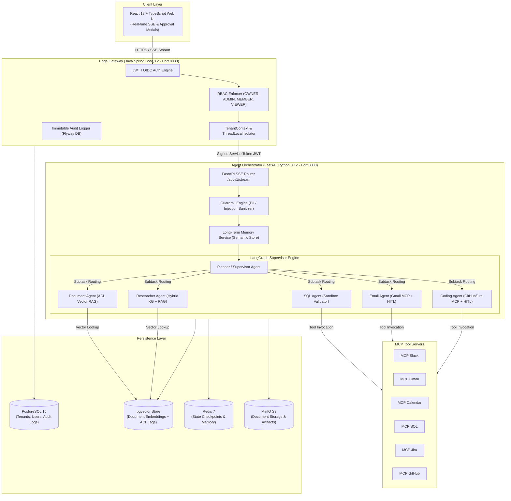
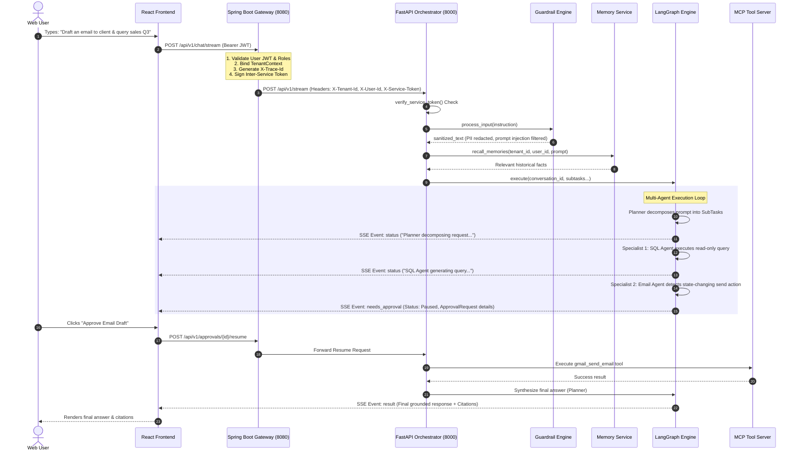
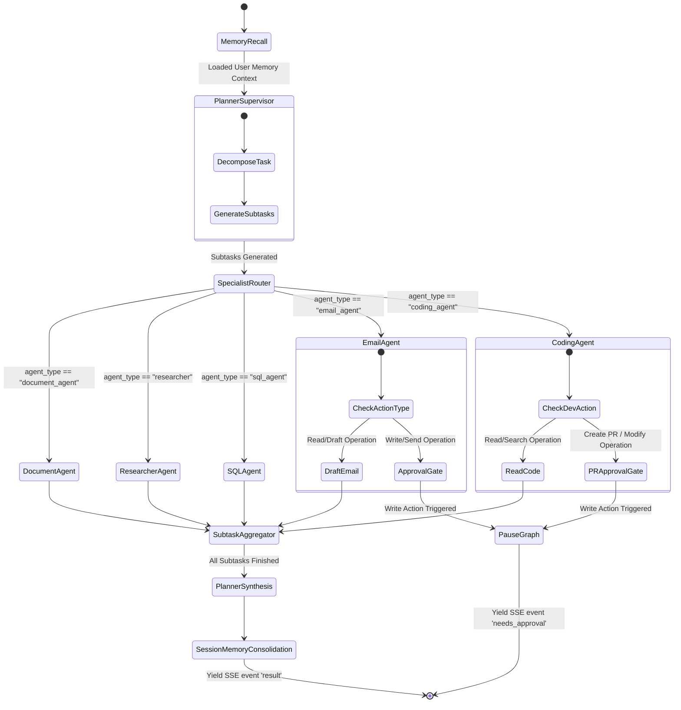
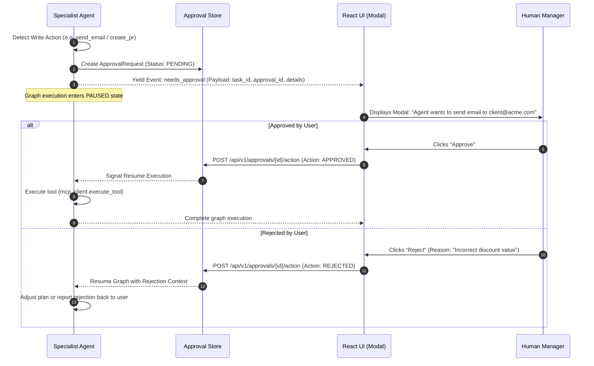

# 📘 Enterprise AI Worker — Technical Architecture & Workflow Guide

> **Interview-Ready Deep Dive into System Architecture, Multi-Agent Orchestration, End-to-End Request Flow, MCP Tool Infrastructure, Security & Human-in-the-Loop (HITL) Design.**

---

## 📑 Table of Contents

1. [Executive Summary & High-Level System Overview](#1-executive-summary--high-level-system-overview)
2. [Dual-Stack Architecture & Microservice Topology](#2-dual-stack-architecture--microservice-topology)
3. [End-to-End Request Flow (Client API → Output)](#3-end-to-end-request-flow-client-api--output)
4. [Multi-Agent Orchestration Engine (LangGraph Supervisor Pattern)](#4-multi-agent-orchestration-engine-langgraph-supervisor-pattern)
5. [Specialist Agents Deep Dive](#5-specialist-agents-deep-dive)
6. [Human-in-the-Loop (HITL) Approval Checkpoint Engine](#6-human-in-the-loop-hitl-approval-checkpoint-engine)
7. [Model Context Protocol (MCP) Tool Integration](#7-model-context-protocol-mcp-tool-integration)
8. [Multi-Tenant Isolation, ACL RAG & Security Architecture](#8-multi-tenant-isolation-acl-rag--security-architecture)
9. [Long-Term Memory & Fact Consolidation Engine](#9-long-term-memory--fact-consolidation-engine)
10. [Interview Preparation Cheat Sheet & Architectural Q&A](#10-interview-preparation-cheat-sheet--architectural-qa)

---

## 1. Executive Summary & High-Level System Overview

**Enterprise AI Worker** is an enterprise-grade SaaS platform designed to act as an autonomous "AI Employee". Unlike basic LLM wrappers, it handles multi-step enterprise tasks across Slack, Gmail, Google Calendar, SQL databases, Jira, GitHub, and internal document repositories.

### Key Highlights for Technical Interviews
- **Decoupled Dual-Stack Topology**: Combines **Java 17/21 Spring Boot** (for high-throughput auth, multi-tenant RBAC, enterprise compliance, and API edge routing) with **Python 3.12 FastAPI** (for LLM execution, graph orchestration, vector RAG, and MCP integrations).
- **Supervisor-Specialist Multi-Agent System**: Built using **LangGraph**, where a **Planner (Supervisor)** agent dynamically decomposes complex instructions into subtasks and delegates execution to domain specialists (`Document`, `Researcher`, `SQL`, `Email`, `Coding`).
- **Standardized Tool Protocol (MCP)**: Exposes tool connectors via Model Context Protocol servers to isolate integration side-effects and standardise schema discovery.
- **Human-in-the-Loop (HITL) Checkpoints**: State-changing operations (`send_email`, `github_create_pr`, SQL writes) automatically pause graph execution and create audit-backed approval requests.
- **ACL-Aware Vector RAG**: Enforces dual-layer security: strict `tenant_id` isolation plus document-level Access Control List (ACL) permission matching.

---

## 2. Dual-Stack Architecture & Microservice Topology



### Component Roles & Design Trade-Offs

| Component | Stack | Responsibilities | Why This Choice? |
|---|---|---|---|
| **Edge Gateway** | Java 17 / Spring Boot 3.2 | AuthN/AuthZ, Tenant Context propagation, Rate limiting, Database Migrations (Flyway), Inter-service JWT signing | Java offers enterprise stability, strict typing, high concurrent IO throughput, and standard enterprise security integrations. |
| **Agent Orchestrator** | Python 3.12 / FastAPI | LangGraph dynamic graph execution, LLM provider switching, Vector search, Guardrail filtering | Python is the standard ecosystem for AI/LLM libraries (LangChain, LangGraph, PyDantic, OpenAI SDK). |
| **MCP Tool Infrastructure** | Python / Node | Dedicated MCP micro-servers exposing Slack, Gmail, Jira, GitHub, SQL tools | Standardizes tool schemas; isolates third-party API dependencies from core orchestration logic. |
| **Data & Memory Layer** | PostgreSQL 16 + pgvector, Redis, MinIO | Storage of tenant metadata, vector embeddings, graph checkpoints, audit logs, and document artifacts | `pgvector` allows operational simplicity by storing relational data and vector embeddings in a single ACID DB. |

---

## 3. End-to-End Request Flow (Client API → Output)

Here is the exact step-by-step lifecycle of a user request flowing through the system:



### Detailed Execution Steps

1. **Authentication & Inter-Service Security**:
   - The user sends a request from the React UI to the **Spring Boot Gateway**.
   - Gateway verifies JWT signature, checks user role (`OWNER`, `ADMIN`, `MEMBER`, `VIEWER`), and injects `TenantContext`.
   - Gateway attaches `X-Tenant-Id`, `X-User-Id`, `X-User-Role`, and `X-Trace-Id` headers and signs the internal HTTP request using `SERVICE_TO_SERVICE_SECRET`.
2. **Ingress Filtering & Audit Logging**:
   - FastAPI inspects headers via `verify_service_token` dependency.
   - `GuardrailPipeline` scans user input for prompt injection vectors and redacts sensitive PII (SSN, credit card patterns).
   - An immutable audit log entry `CHAT_STREAM_STARTED` is recorded with `trace_id`.
3. **Context Recall**:
   - `MemoryService` queries long-term memory stores for facts and user preferences relevant to the input instruction.
4. **LangGraph Execution Loop**:
   - `MultiAgentGraph.execute()` is invoked as an asynchronous generator.
   - **Planner Agent** breaks the instruction into explicit `SubTask` structures.
   - Specialist agents run iteratively.
5. **Human-in-the-Loop Gating**:
   - If a specialist (e.g. `EmailAgent` or `CodingAgent`) detects a state-changing write action, it returns `status: "needs_approval"`.
   - The SSE stream yields a `needs_approval` event payload containing an `ApprovalRequest` record, and execution pauses.
   - Upon explicit user confirmation via UI modal, execution resumes state safely.
6. **Synthesis & SSE Delivery**:
   - **Planner Agent** aggregates output across all subtasks, formats citations, and streams final text tokens to the UI over Server-Sent Events (`text/event-stream`).

---

## 4. Multi-Agent Orchestration Engine (LangGraph Supervisor Pattern)

The core brain of the platform is the **MultiAgentGraph**, implementing a **Supervisor Router** state-machine pattern.



### Graph State Object (`TaskGraphState`)

State is strictly typed across graph nodes using PyDantic and `TypedDict`:

```python
class TaskGraphState(TypedDict):
    conversation_id: str
    tenant_id: str
    user_id: str
    user_role: str
    user_acls: List[str]
    messages: List[Dict[str, Any]]
    subtasks: List[Dict[str, Any]]
    current_subtask_index: int
    citations: List[Dict[str, Any]]
    intermediate_steps: List[Dict[str, Any]]
    next_step: str
    final_response: Optional[str]
```

---

## 5. Specialist Agents Deep Dive

Every specialist agent in `app/agents/` inherits from `BaseAgent` and has a distinct domain responsibility:

```
                                  ┌──────────────────┐
                                  │   BaseAgent      │
                                  └────────┬─────────┘
                                           │
         ┌──────────────────┬──────────────┼──────────────┬──────────────────┐
         ▼                  ▼              ▼              ▼                  ▼
┌─────────────────┐ ┌──────────────┐ ┌───────────┐ ┌──────────────┐ ┌────────────────┐
│  DocumentAgent  │ │ResearcherAgnt│ │ SQLAgent  │ │  EmailAgent  │ │  CodingAgent   │
│ (ACL Vector RAG)│ │(Hybrid KG/RAG│ │(SQL Sandbx│ │(Gmail + HITL)│ │(GH/Jira + HITL)│
└─────────────────┘ └──────────────┘ └───────────┘ └──────────────┘ └────────────────┘
```

### 1. Document Agent (`document_agent.py`)
- **Purpose**: Answers user queries by searching uploaded tenant documents.
- **Workflow**: Generates query vector embeddings -> queries `VectorStore` with `tenant_id` & `user_acls` -> returns matching chunks + `Citation` objects.

### 2. Researcher Agent (`researcher.py`)
- **Purpose**: High-depth research across unstructured text and structured entity graphs.
- **Workflow**: Hybrid retrieval combining vector similarity search with Knowledge Graph multi-hop entity traversal to synthesize multi-document findings.

### 3. SQL Agent (`sql_agent.py`)
- **Purpose**: Natural Language to SQL analytics query execution.
- **Security Control**: Routes all queries through `SQLValidator` sandbox:
  - Rejects forbidden DDL/DML keywords (`INSERT`, `UPDATE`, `DELETE`, `DROP`, `ALTER`).
  - Enforces mandatory `WHERE tenant_id = :tenant_id` predicate injection.
  - Automatically appends `LIMIT 100` if absent.

### 4. Email Agent (`email_agent.py`)
- **Purpose**: Inspects inbox, drafts replies, and dispatches email via Gmail API MCP Server.
- **Approval Logic**: Reading and drafting operate automatically. Actual `send_email` calls pause graph execution for human approval.

### 5. Coding Agent (`coding_agent.py`)
- **Purpose**: Explores repositories, checks Jira issue status, links commits, and submits Pull Requests via GitHub/Jira MCP Servers.
- **Approval Logic**: Read/search operations proceed automatically. Branch pushing or PR creation triggers human approval gating.

---

## 6. Human-in-the-Loop (HITL) Approval Checkpoint Engine

To prevent catastrophic autonomous AI errors (e.g. sending incorrect external emails or dropping code changes), state-changing operations are gated by human verification.



### Key Technical Implementation Details
- **State Checkpointing**: The exact `TaskGraphState` and pending tool payload are persisted in Redis / Postgres.
- **Approval Expiry**: Approval requests carry a TTL (e.g. 24 hours). Expired requests are automatically marked `EXPIRED` to block stale execution.
- **Auditability**: Approval actions store `actor_id`, `timestamp`, `action`, and `reason` for compliance audit trails.

---

## 7. Model Context Protocol (MCP) Tool Integration

Tools are integrated using the standard **Model Context Protocol (MCP)** specification via a centralized client registry (`app/mcp/mcp_client.py`).

```
                              ┌──────────────────┐
                              │    MCPClient     │
                              └────────┬─────────┘
                                       │
        ┌──────────────┬───────────────┼───────────────┬──────────────┬──────────────┐
        ▼              ▼               ▼               ▼              ▼              ▼
  ┌───────────┐  ┌───────────┐   ┌───────────┐   ┌───────────┐  ┌───────────┐  ┌───────────┐
  │ Slack MCP │  │ Gmail MCP │   │CalendarMCP│   │  SQL MCP  │  │ Jira MCP  │  │GitHub MCP │
  └───────────┘  └───────────┘   └───────────┘   └───────────┘  └───────────┘  └───────────┘
```

### Why MCP over standard OpenAI function calling?
1. **Separation of Concerns**: Tool execution logic runs inside isolated micro-servers with their own environment credentials.
2. **Dynamic Tool Schema Aggregation**: `MCPClient.list_all_tools()` queries registered servers dynamically to assemble OpenAI JSON schemas at runtime.
3. **Prefix Routing**: Routing to the right server is deterministic based on tool names (e.g. `slack_*`, `gmail_*`, `github_*`, `sql_*`).

---

## 8. Multi-Tenant Isolation, ACL RAG & Security Architecture

Enterprise environments mandate zero risk of cross-tenant data leakage or unauthorized internal document access.

```
                              Incoming Query
                                     │
                                     ▼
                      ┌─────────────────────────────┐
                      │  Tenant Isolation Filter    │
                      │   chunk.tenant_id == tenant │
                      └──────────────┬──────────────┘
                                     │ Pass
                                     ▼
                      ┌─────────────────────────────┐
                      │    ACL Security Check       │
                      │  Is Role OWNER/ADMIN?       │
                      └──────┬───────────────┬──────┘
                         Yes │               │ No
                             ▼               ▼
                      ┌────────────┐   ┌────────────────────────────┐
                      │ Access     │   │ User ACL Tag Verification  │
                      │ Granted    │   │ Any(tag in user_acls)?     │
                      └────────────┘   └──────┬──────────────┬──────┘
                                          Yes │              │ No
                                              ▼              ▼
                                       ┌────────────┐  ┌────────────┐
                                       │ Access     │  │ Blocked    │
                                       │ Granted    │  │ (Filtered) │
                                       └────────────┘  └────────────┘
```

### 1. Multi-Tenant Isolation
- **Edge Layer**: `TenantContext` extracts `X-Tenant-Id` from authenticated JWT claims.
- **Relational DB**: Every SQL query is parameterized with `WHERE tenant_id = :tenant_id`.
- **Vector DB**: `VectorStore.search()` enforces hard evaluation: `if chunk.tenant_id != tenant_id: continue`.

### 2. ACL-Aware Document Retrieval
- Documents are tagged with Access Control List labels during ingestion (e.g., `["FINANCE_READ", "HR_CONFIDENTIAL"]`).
- Non-admin users are restricted: unless `user_role` is `OWNER` or `ADMIN`, a chunk is returned **only if** `any(acl in user_acls for acl in chunk.acl)` evaluates to `True`.

### 3. Prompt-Injection Defense & Untrusted Data Wrapping
- Input text is checked via regex & heuristic guardrails for prompt-hijacking patterns (e.g. `"Ignore previous instructions"`).
- Retrieved third-party chunks are wrapped in `<untrusted_data>` tags when passed to LLMs to prevent indirect prompt injection attacks.

---

## 9. Long-Term Memory & Fact Consolidation Engine

To deliver personalized employee experiences, the system maintains short-term session state and long-term semantic memory.

```
Session History ──► Memory Extraction ──► Semantic Store (Vector + KV) ──► Prompt Context Injection
```

1. **Recall Phase**: Prior to graph execution, `MemoryService.recall_memories()` queries stored user facts using semantic similarity.
2. **Consolidation Phase**: Post-execution, session transcripts are processed asynchronously to extract durable facts (e.g., `"User prefers SQL output formatted as CSV"`, `"User's team handles billing issues"`).
3. **Storage**: Durable facts are stored with `tenant_id` and `user_id` scope to ensure complete user-level privacy.

---

## 10. Interview Preparation Cheat Sheet & Architectural Q&A

Use these high-impact answers when explaining the architecture to tech leads and interviewers:

### Q1: "Why did you choose a dual-stack architecture (Spring Boot + FastAPI)?"
> *"We decoupled concerns based on ecosystem strengths. **Spring Boot** is unbeatable for enterprise API gateways—it provides robust JWT authentication, thread-safe `TenantContext` isolation, RBAC filters, database migrations with Flyway, and reliable audit logging. **FastAPI**, on the other hand, gives us seamless integration with Python's rich AI ecosystem (LangGraph, PyDantic, OpenAI/Gemini SDKs, vector search). The two communicate over authenticated HTTP using signed inter-service JWT tokens."*

### Q2: "How do you handle stateful multi-agent execution and routing?"
> *"We use **LangGraph** implementing a Supervisor-Specialist pattern. A **Planner Agent** acts as the supervisor, receiving the user prompt, recalling long-term memories, and breaking the goal into typed `SubTask` structures. The graph then routes subtasks to domain-specific specialists (`Document`, `Researcher`, `SQL`, `Email`, `Coding`). The Planner synthesizes the final answer with source citations."*

### Q3: "How do you guarantee multi-tenant security and prevent data leaks in RAG?"
> *"Security is enforced at two distinct layers:*
> 1. *Strict **Tenant Isolation**: Every database query and vector similarity lookup filters strictly on `tenant_id`.*
> 2. ***ACL Tag Matching**: Document chunks carry permission tags. Non-admin queries require an intersection between the user's granted ACL permissions (`user_acls`) and the document tags. Furthermore, retrieved content is wrapped in `<untrusted_data>` XML blocks to prevent prompt injection."*

### Q4: "How does Human-in-the-Loop (HITL) work when an agent needs to send an email or push code?"
> *"When a specialist agent generates a state-changing operation (like `send_email` or `create_pull_request`), it pauses graph execution. The system creates an `ApprovalRequest` record in the database and streams a `needs_approval` event to the user's browser over SSE. The state is checkpointed in Redis. Once a human manager approves or rejects the action via the UI modal, execution resumes seamlessly."*

### Q5: "How did you implement Text-to-SQL safely without risking SQL injection or unauthorized DB modifications?"
> *"All natural language SQL generation flows through a strict **SQL Sandbox Validator**:*
> - *It enforces `SELECT`-only execution, rejecting any query containing DDL or DML keywords (`INSERT`, `UPDATE`, `DELETE`, `DROP`).*
> - *It injects `WHERE tenant_id = :tenant_id` dynamically into the query AST/SQL string.*
> - *It forcibly appends a limit (`LIMIT 100`) to prevent memory overflow or DOS attacks."*

### Q6: "What is Model Context Protocol (MCP) and why did you use it?"
> *"Model Context Protocol (MCP) standardizes how LLM agents interact with external tools and databases. Instead of hardcoding third-party API clients inside agent files, we run dedicated MCP servers (for Slack, Gmail, Jira, GitHub, SQL). The `MCPClient` dynamically discovers tool definitions, standardizes parameters, and routes tool calls cleanly while keeping external credentials isolated."*

---

### 📌 Summary of Architecture Specifications

| Feature | Technical Implementation |
|---|---|
| **Gateway Auth** | Java Spring Boot 3.2, JWT / OIDC, RBAC, ThreadLocal `TenantContext` |
| **Agent Framework** | Python 3.12, FastAPI, LangGraph Multi-Agent Supervisor |
| **LLM Support** | Pluggable Abstraction (OpenAI `gpt-4o`, Google Gemini `gemini-2.5-flash`) |
| **Streaming** | Server-Sent Events (`text/event-stream`) streaming real-time status & tokens |
| **RAG Security** | `pgvector` with dual-layer `tenant_id` + ACL permission array matching |
| **Tool Architecture** | Model Context Protocol (MCP) across Slack, Gmail, Calendar, SQL, Jira, GitHub |
| **Safety & Audit** | PII redaction, prompt injection filtering, SOC2 immutable audit log with `trace_id` |
